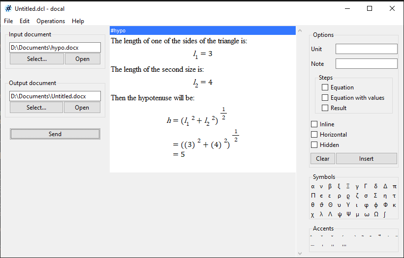
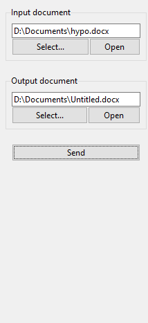
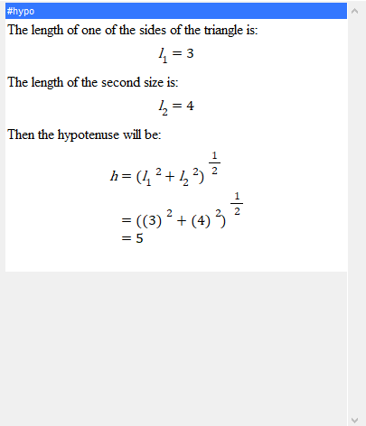
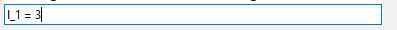
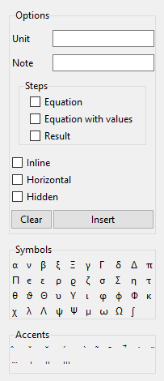
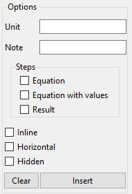
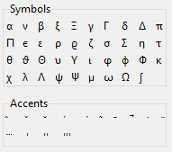

[//]: # (-{pandoc.exe %f --standalone --metadata pagetitle="Reference" -f markdown-auto_identifiers -o ..\html\reference.html --css help.css})

# Reference

## Interface

### Menubar

The menubar is where you carryout standard operations. It has four sections:

* File: file operations like save and open
* Edit: editting tasks like cut, copy and paste, and undo and redo.
* Operations: alternative ways to do the sidebar tasks
* Help: Help and about

### Sidebar

The sidebar is where you prepare the input and output documents and send the
calculations to the output document. You can also open them from here.

### Worksheet

The worksheet is the main part of the application. It is where you do your work. It is made up of steps.

#### Step

A step is a single line in the worksheet. It has an input and an output. You write the input and docal writes the output. The input can be any of text, calculation, equation, tag, option or comment.

### Toolbar

docal is designed in such a way that you can write everything using the
keyboard. But it may be difficult to remember what to write in order to get
something particular. That's why there is the toolbar.  In the toolbar, you can
find some assistive items if you don't know how to write them.

#### Options pane

Options customize how a calculation step is written.

#### Symbols ans Accents Pane

Symbols write what is necessary to get the symbol shown when clicked.

## Step Types

### Text

A text is a... text. It is not evaluated. To write a text, start or end with a space.

### Calculation

A calculation is like a formula that will get evaluated. If it contains the name of a value, docal looks for the value from above the step and will substitute it to get the result. To write a calculation, write is just as you would on a calculator.

### Equation

An equation is a math that is not evaluated but is merely shown. To write an inline equation, start with $. To write a display equation, start with $$.

### Tag

A tag is a specifier for a place in the input document. The steps below the tag are instead at the place in the document specified by the same tag. To insert a tag, write is in the hashtag notation (e.g. #hashtag).

### Options

Options customize how the subsequent calculations are written.

### Comment

A comment is a text that is not put in the document and doesn't do anything. It may be useful to write some hidden notes.
