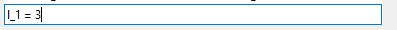
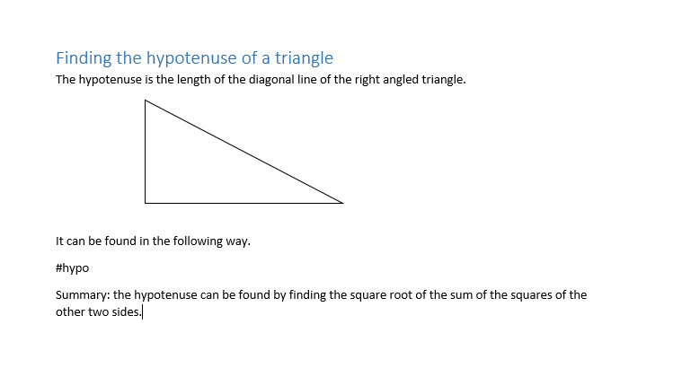

[//]: # (-{pandoc.exe %f --standalone --metadata pagetitle="Tutorial" -f markdown-auto_identifiers -o ..\html\tutorial.html --css help.css})

# Tutorial

Welcome to the tutorial. If you think you are a beginner, start with the first one.
simple one. Otherwise, go to the second one.

## Creating a simple worksheet

In this tutorial, we will create a Word document that contains only some
calculations and text. The content that will be used as an example is the
procedure to find the length of the hypotenuse of a right angled triangle.

### Opening docal

If you got the installer setup and installed it, you can find docal in your
Start menu. If you got the portable version, then you can open docal by
unpacking the zip file, opening the resulting folder and double clicking
__docal.exe__. Once opened, it should look like this:

For now, we will focus on the middle area, the _worksheet_. A single line in
the worksheet is called a _step_ (You can look in the
[Reference](reference.html) for a complete help on the interface). You can
write your content on it and it will show you what it will look like in the
document. There are a couple of things you can type in the step input. We will
use _text_ and _calculations_ for this tutorial.

### Inserting text

docal recognizes any input that starts or ends with a space as text. It will not be evaluated but it will be shown as is. Now we will start writing our content.

Start with a space and write the following.

 

Now when you press [Enter], it will change to:

Not much of a change but it shows some important points.

* When you press [Enter], what you wrote in the current step will be changed to what it will look like in the document. This applies to any type of input.
* And if the current step is the last, another step will be created.

### Inserting calculations

docal's main point is making calculations easy to do and documentable. Therefore, a lot of work has gone into optimizing how calculations are made.

We are about to give the value of one of the sides of the triangle. So write:

And press [Enter]. It will change to:

Some points to notice:

* Since equations are normally shown like this, it is put in the center.
* You wrote l_1 but it changed 1 to a subscript. This is part of the name changing facility.
* As in the previous step, another step was added.

While we're at it, let's insert the second size of the triangle and make it look like this:

Now the exciting part! We will then use the two values to get the hypotenuse. Write the hypotenuse formula:

This is the same as we would enter it in a calculator, except we used the names of the values of the lengths (l_1 and l_2) instead of the actual values. Now when you press [Enter], it should change to something like:

Awesome, right? But you might have witnessed that we forgot to write what we were about to do before calculating the hypotenuse (what h is.) So we will write that. Click on the the l_2 step. It will bring back what we wrote and expect us to write something. You can also travel around in the worksheet by pressing the up and down arrow keys.

Now making sure that the cursor is at the end, press [Ctrl] + [Enter]. This will split the current step content you wrote into two steps, thats why you should be at the end to insert a new step. It should look like this:

Some points to notice:

* Steps are editable, by clicking or by pressing the up and down keys.

  * If the step is a calculation, and its value changes, subsequent calculations that depend on it get updated automatically.

* Steps can be split into two by pressing [Ctrl] + [Enter]
* Additionally, steps can be merged by going to the beginning and pressing the Backspace key.

You can then write a text that explains what we will do next. After you press [Enter], the whole work will look like:

### "Exporting" the document

Now that we have finished our work, we can get an actual Word document. For
that we will use the _sidebar_. In the sidebar, we can select two documents:
the input and output document. For this work, we will only select an output. So
click the [Select...] button. It bring a save window. This is asking you where
you want your document to be saved. Select an appropriate location and name.

Press the big [Send] button. It will bring another save window. This is for
saving your calculation. It is asking you because this is a new work. If you
are working on an already existing document, it will automatically save it and
proceed.

* To get your work in a document, you first have to save it in its own .dcl file. This file contains your work and information on the input and output documents. It is like any other file that an application creates. It can be saved, opened, renamed and shared. It enables you to continue your work after closing and opening the application.

If everything went alright, it will tell you and ask you if you want to open
your document.

You have finished this tutorial. But the saved calculation .dcl file is needed for the next tutorial.

## Inserting calculations into an existing document

In this tutorial, calculations will be injected into an existing Word document. We will reuse the work from the previous tutorial.

### Opening an existing calculation

You can open a saved .dcl file just like any file. If you have installed docal,
then you can open it by just double clicking it or opening docal first and
going to File > Open.

### Tags: Creating the input document

The input document is the template that docal puts your calculation work into and create the output document. To make it clear, the output document is created automatically. That means, if you lose it, or delete it, as long as you have the .dcl file and the input document, you can recreate it.

You specify where the calculations are supposed to be in the document using hashtags. And use the same hashtags in the calculations as sections. Let's see.

Create a word document that looks something like this.

Now you tell docal about the input document by pressing the [Select...] button on the input document area, and selecting it.

You can change the output document or you can keep the last one.

Now let's specify which hashtag the calculation is for. To do this, we will put the hashtag at the top. Go to the first step (the text) and put the cursor in the beginning by pressing [Home]. Then write the same hashtag you wrote in the document.

Now press [Ctrl] + [Enter]. You will have split the step and the tag will be shown above your current step.

Now press [Enter]. You have specified the tag. You can click the [Send] button. After sending, the output document will be like this:

You have finished this tutorial.
